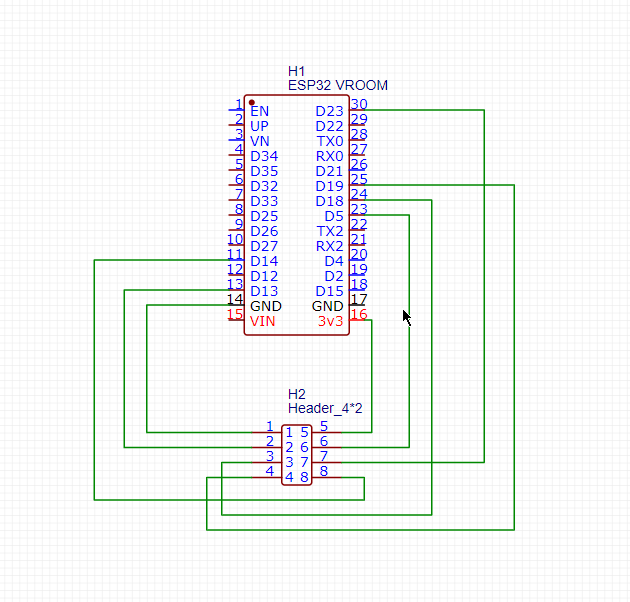
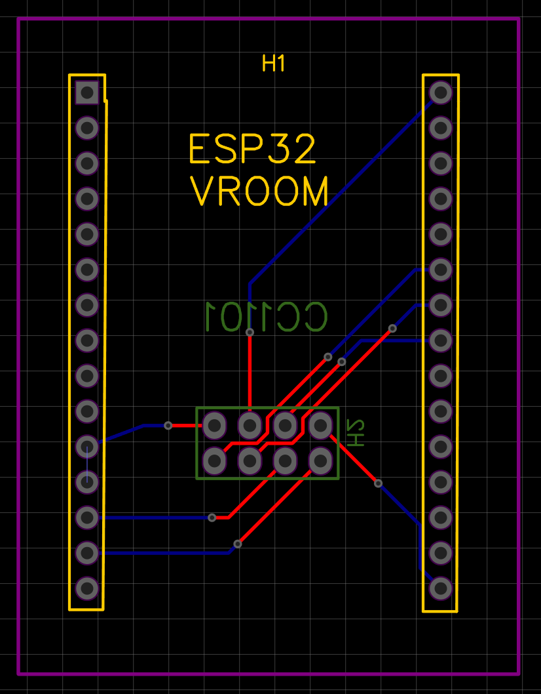

# ESPSomfy-RTS-PCB
a simple PCB for ESPSomfy-RTS for ESP32 VROOM

this simple PCB is created with EasyEDA. The goal is to make a very simple PCB for [ESPSomfy-RTS](https://github.com/rstrouse/ESPSomfy-RTS) from Robert Strouse.

2 files available : 

  - SCH_espsomfyrts.json : the schematic
    
   
 
  - PCB_PCB_espsomfyrts.json :  The PCB itself already routed
        

The PCB is a simple 2 layer with some vias.

> **⚠️ Important**
>
> After flashing ESPSomfy-RTS, open the Web UI and change the **Radio RX Pin** setting from **GPIO 12** to **GPIO 14**. This PCB is designed to use **GPIO 14** for the radio RX signal, as it provides more reliable operation than **GPIO 12** on some ESP32 boards.
You can directly import the files in EasyEDA.

If you need help with EasyEDA and how to order PCB online you can check lot of video on Youtube.

For example [this very good one](https://www.youtube.com/watch?v=aICfPYkbBus) (in French) 

If you want to add PCB for other ESP32 boards feel free to make a PR !

